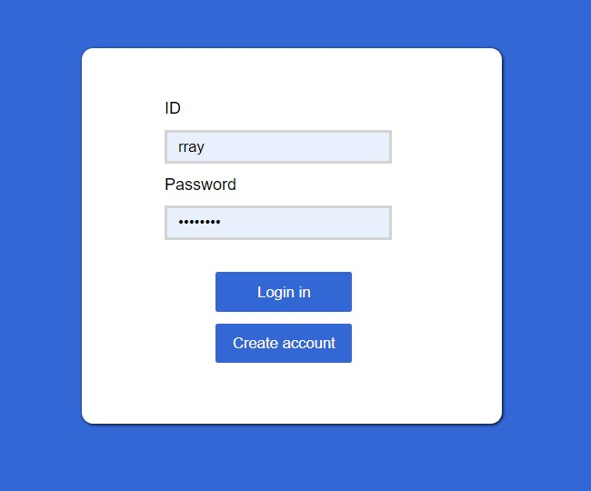
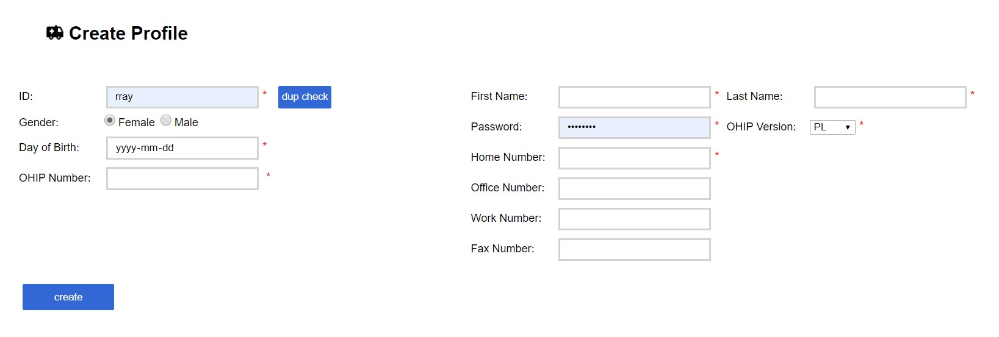
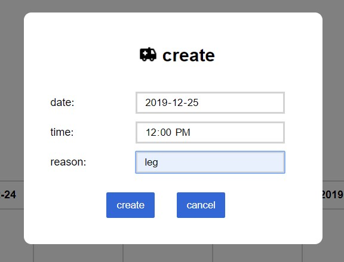
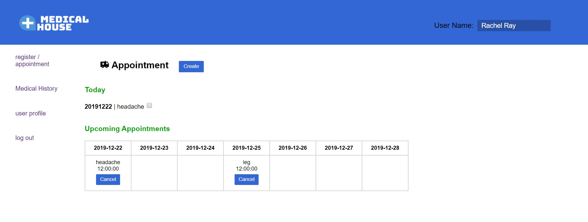
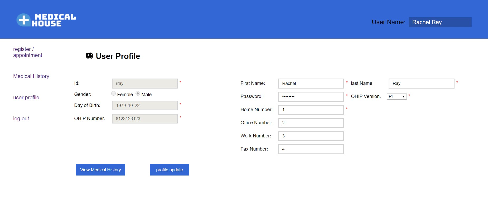

# Medical House
## 1. login

## 2. create profile

## 3. appoint create

## 4. main page

## 5. medical history

## 6. update profile

## Technologies
> Java, Servlet, JSP, EL, JSTL, JDBC, MYSQL, JavaScript, CSS